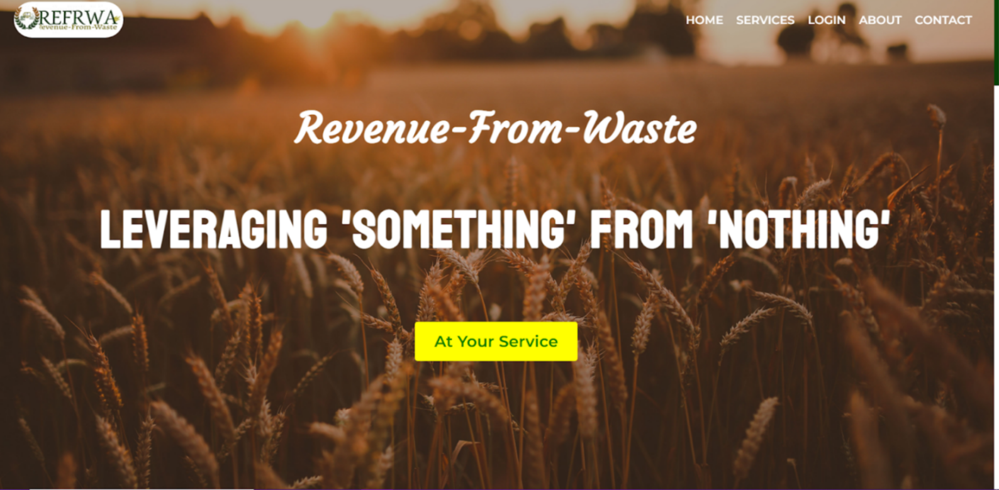
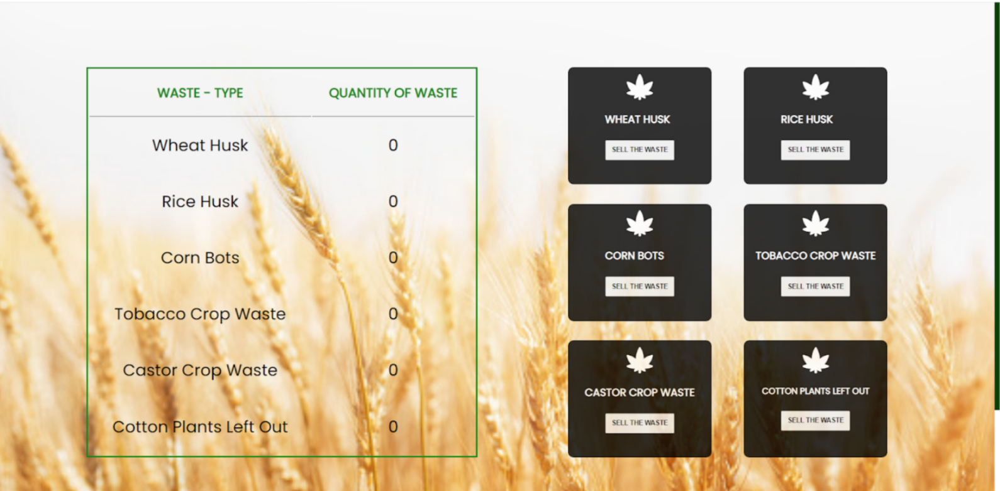

# Farmer Friendly Web App

This is a Web Application made by the Web Development team as part of Interestship 4.0.

## Table of contents

- [Overview](#overview)
  - [Introduction](#introduction)
  - [Screenshot](#screenshot)
  - [Links](#links)
- [My process](#my-process)
  - [Tech stack](#tech-stack)
  - [What we learned](#what-we-learned)
- [Contributors](#contributors)

## Overview

### Introduction

This web application is an approach to connect farmers and bio-waste industries together for the better management of the farm-waste produced.

### Screenshot

### Links

- Solution URL: [GitHub Repository](https://github.com/aku1310/article-preview-component-master)
- Working Model Video: [Google Drive](https://drive.google.com/file/d/1d82kZHsU2dq2smIKFHGDxAoM0J_m5hOO/view)

## Process

### Tech stack

**Frontend**
- React.js, Material UI, CSS

**Backend**
- Spring Boot, MySQL

### What we learned

This is a full stack application where we learned and implemented various technologies such as:

- **React.js** : Set up React App, using react-router-dom for redirection of pages, axios for integration of backend, etc.
- **Spring Boot** : Set up using Spring Initialzr, making various API's, using Authentication, integrating with frontend, etc.
- **MySQL** : Set up MySQL, making queries to the database, etc.
- **Postman** : Set up Postman, testing the API's made in Spring Boot.

## Contributors

**Akanksha Kushwaha**
- GitHub - [@aku1310](https://github.com/aku1310)
- LinkedIn - [Akanksha Kushwaha](https://www.linkedin.com/in/akankshakushwaha/)

**Aparna Singh**
- GitHub - [@Whizz76](https://github.com/Whizz76)
- LinkedIn - [Aparna Singh](https://www.linkedin.com/in/aparna-singh-bb07a7224)

**Khushi Jain**
- GitHun - [@khushijain6](https://github.com/khushijain6)
- LinkedIn - [Khushi Jain](https://www.linkedin.com/in/khushi-jain-1a46961bb/)

**Srishti Mishra**
- GitHub - [@srishti51](https://github.com/srishti51)
- LinkedIn - [Srishti Mishra](https://www.linkedin.com/in/srishti-mishra-316ab3235/)

**Ritika Malik**
- GitHub - [@ritika728](https://github.com/ritika728)
- LinkedIn - [Ritika Malik](https://www.linkedin.com/in/ritika-malik-must/)